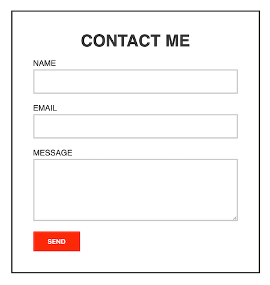

# Contact Form

## Introduction
When you have the time, please drop me a line. You know, with my fancy contact form.

## Objective
For this assignment, you will demonstrate your understanding and skill of CSS Box Model, by styling the provided form. 

## Requirements
The following requirements must be met in order to complete the assignment successfully:

1. Download the [Contact Form starter files](). The files contain an `index.html` file, a `base.css`, and a `style.css` file. **All changes should be to the `style.css` only.**
2. Use the `width`, `height`, `padding`, `border`, `margin`, and `box-sizing` properties to style the contact form and related elements to match the screenshot below.
3. Submit the `style.css` file to the **Contact Form** assignment on Brightspace.

